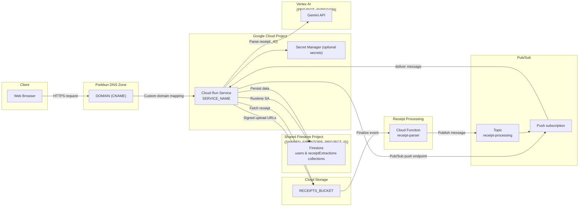
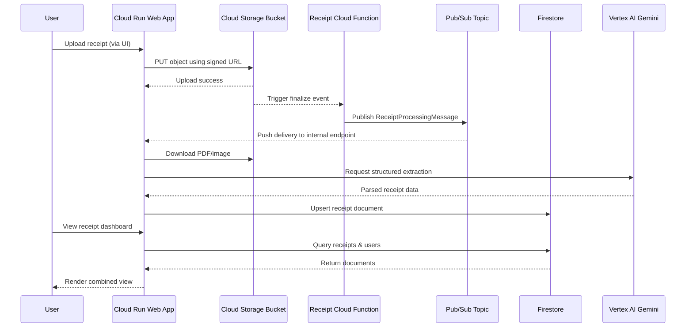
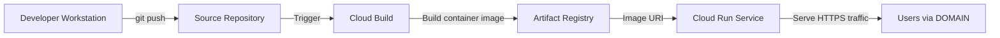

# System Architecture Schematics

The diagrams below illustrate how the responsive auth web application, receipt-processing Cloud Function, and shared Google Cloud resources work together. Replace placeholder values (for example `PROJECT_ID`, `DOMAIN`, or `RECEIPTS_BUCKET`) with your real identifiers when applying the design.

---

## High-Level Service Topology

**Key points**

- The Cloud Run service owns Firestore access while the Cloud Function only requires Pub/Sub publish permissions, keeping the event bridge lightweight.
- Custom domain traffic (`DOMAIN`) is routed through Porkbun DNS to the Cloud Run HTTPS endpoint created by the Cloud Run domain mapping workflow.
- Secrets, OAuth credentials, and API keys should be stored in Secret Manager and referenced through environment variables rather than being hard-coded.

---

## Receipt Processing Sequence

**Notes**

- The Cloud Run service persists parsed receipts in Firestore using the `FIRESTORE_PROJECT_ID` / `RECEIPT_FIRESTORE_COLLECTION` configuration. The Cloud Function simply publishes to Pub/Sub and runs without Spring or additional frameworks.
- The signed URL upload pattern prevents the Cloud Run service from proxying large files, while still enforcing authenticated access and storage permissions.

---

## Deployment & Delivery Pipeline

**Operational checklist**

- The `scripts/deploy_cloud_run.sh` and `scripts/deploy_cloud_function.sh` scripts reuse the same environment configuration to keep the Firestore project, service accounts, and regions consistent.
- Cloud Build can be replaced with local Docker builds if preferred—ensure the final image is pushed to a registry accessible by Cloud Run.
- After deployment, run the domain mapping workflow so `DOMAIN` resolves to the new Cloud Run service, and verify TLS certificates are provisioned before flipping production traffic.
