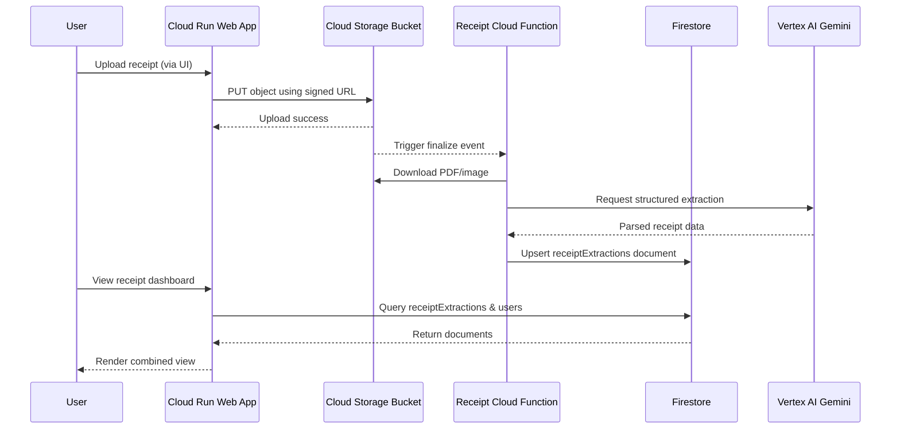
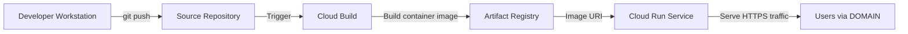

# System Architecture Schematics

The diagrams below illustrate how the responsive auth web application, receipt-processing Cloud Function, and shared Google Cloud resources work together. Replace placeholder values (for example `PROJECT_ID`, `DOMAIN`, or `RECEIPTS_BUCKET`) with your real identifiers when applying the design.

---

## High-Level Service Topology

```mermaid
flowchart LR
    subgraph Client[Client]
        Browser[Web Browser]
    end

    subgraph DNS[Porkbun DNS Zone]
        Domain[DOMAIN (CNAME)]
    end

    subgraph CloudRun[Google Cloud Project \n(PROJECT_ID)]
        WebApp[Cloud Run Service \nSERVICE_NAME]
        Secrets[Secret Manager (optional secrets)]
    end

    subgraph SharedFirestore[Shared Firestore Project \n(SHARED_FIRESTORE_PROJECT_ID)]
        Firestore[(Firestore \nusers & receiptExtractions collections)]
    end

    subgraph Storage[Cloud Storage]
        Bucket[(RECEIPTS_BUCKET)]
    end

    subgraph Functions[Receipt Processing]
        GCF[Cloud Function \nreceipt-parser]
    end

    subgraph VertexAI[Vertex AI \n(PROJECT_ID/REGION)]
        Gemini[Gemini API]
    end

    Browser -->|HTTPS request| Domain
    Domain -->|Custom domain mapping| WebApp
    WebApp -->|Runtime SA| Firestore
    WebApp --> Secrets
    WebApp -->|Signed upload URLs| Bucket
    Bucket -->|Finalize event| GCF
    GCF -->|Download object| Bucket
    GCF -->|Parse receipt| Gemini
    GCF -->|Write parsed data| Firestore
    WebApp -->|Query receipts & users| Firestore
```

**Key points**

- The Cloud Run service and Cloud Function both use identities with the `roles/datastore.user` role against the shared Firestore project so user profiles and receipt documents live in the same database.
- Custom domain traffic (`DOMAIN`) is routed through Porkbun DNS to the Cloud Run HTTPS endpoint created by the Cloud Run domain mapping workflow.
- Secrets, OAuth credentials, and API keys should be stored in Secret Manager and referenced through environment variables rather than being hard-coded.

---

## Receipt Processing Sequence



**Notes**

- The Cloud Function and Cloud Run service share the same Firestore collections. Environment variables such as `FIRESTORE_PROJECT_ID`, `RECEIPT_FIRESTORE_PROJECT_ID`, and `RECEIPT_FIRESTORE_COLLECTION` must point to the shared project and collection names.
- The signed URL upload pattern prevents the Cloud Run service from proxying large files, while still enforcing authenticated access and storage permissions.

---

## Deployment & Delivery Pipeline



**Operational checklist**

- The `scripts/deploy_cloud_run.sh` and `deploy-cloud-function.sh` scripts reuse the same environment configuration to keep the Firestore project, service accounts, and regions consistent.
- Cloud Build can be replaced with local Docker builds if preferred—ensure the final image is pushed to a registry accessible by Cloud Run.
- After deployment, run the domain mapping workflow so `DOMAIN` resolves to the new Cloud Run service, and verify TLS certificates are provisioned before flipping production traffic.
