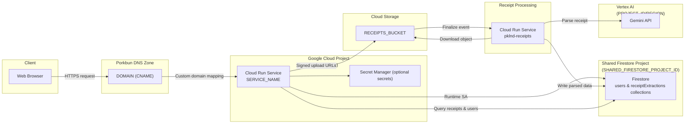
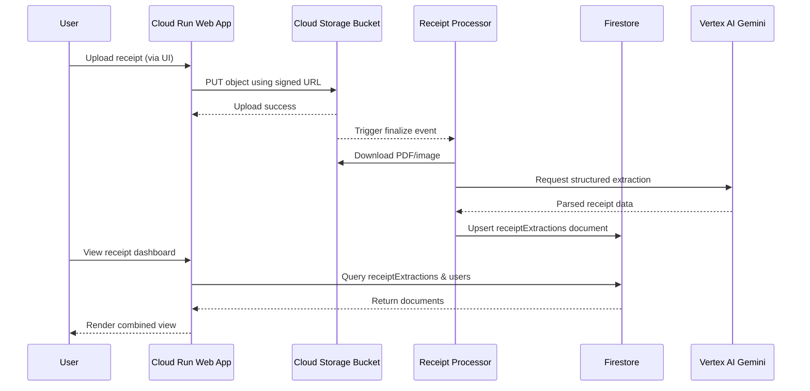
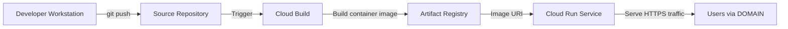

# System Architecture Schematics

The diagrams below illustrate how the pklnd web application, receipt-processing Cloud Run service, and shared Google Cloud resources work together. Replace placeholder values (for example `PROJECT_ID`, `DOMAIN`, or `RECEIPTS_BUCKET`) with your real identifiers when applying the design.

Both deployable services now enable Spring Modulith. Packages called out below map one-to-one with Modulith application modules so the generated diagrams stay consistent with the verified architectural boundaries.

---

## High-Level Service Topology

**Key points**

- Both Cloud Run services use identities with the `roles/datastore.user` role against the shared Firestore project so user profiles and receipt documents live in the same database.
- Custom domain traffic (`DOMAIN`) is routed through Porkbun DNS to the Cloud Run HTTPS endpoint created by a manual Cloud Run domain mapping.
- Secrets, OAuth credentials, and API keys should be stored in Secret Manager and referenced through environment variables rather than being hard-coded.

---

## Receipt Processing Sequence

**Notes**

- The two Cloud Run services share the same Firestore collections. Environment variables such as `PROJECT_ID`, `FIRESTORE_PROJECT_ID`, and `RECEIPT_FIRESTORE_COLLECTION` must point to the shared project and collection names.
- The signed URL upload pattern prevents the Cloud Run service from proxying large files, while still enforcing authenticated access and storage permissions.

---

## Deployment & Delivery Pipeline

**Operational checklist**

- The `scripts/legacy/deploy_cloud_run.sh` and `scripts/legacy/deploy_receipt_processor.sh` scripts reuse the same environment configuration to keep the Firestore project, service accounts, and regions consistent.
- Prefer the Terraform workflow in [docs/terraform-deployment.md](./terraform-deployment.md) for reproducible infrastructure and deployment; lean on the legacy scripts only when comparing with the previous gcloud-driven path.
- Cloud Build can be replaced with local Docker builds if preferred—ensure the final image is pushed to a registry accessible by Cloud Run.
- After deployment, create or update the Cloud Run domain mapping with `gcloud run domain-mappings create ...` so `DOMAIN` resolves to the new service, and verify TLS certificates are provisioned before flipping production traffic.
